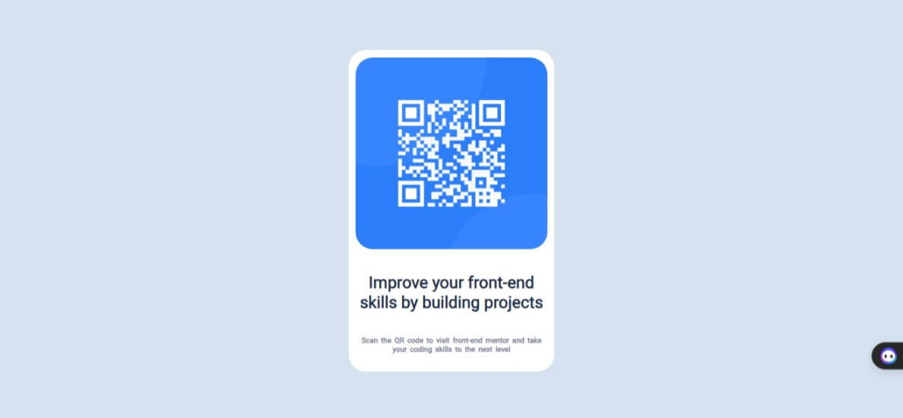

# Frontend Mentor - QR code component solution

This is a solution to the [QR code component challenge on Frontend Mentor](https://www.frontendmentor.io/challenges/qr-code-component-iux_sIO_H). Frontend Mentor challenges help you improve your coding skills by building realistic projects. 

## Table of contents

## Overview

### Screenshot

### Author 

### Useful resources

### Links

- Solution URL: [Add solution URL here](https://github.com/boladimeji834/qr_code-project)
- Live Site URL: [Add live site URL here](https://qr-code-project-ten.vercel.app/)

### Built with
- Semantic HTML5 markup
- CSS custom properties
- Flexbox

### Continued development
css flexbox, grid, and tailwind css

### Useful resources
- [Example resource 1](https://fonts.google.com/specimen/Roboto) - This helped me apply a good looking font in my project. I really liked this pattern and will use it going forward.

## Author
- Website - [Balogun Oladimeji](https://twitter.com/shrewd_ola)
- Frontend Mentor - [@yourusername](https://www.frontendmentor.io/profile/boladimeji834)
- Twitter - [@yourusername](https://twitter.com/shrewd_ola)

